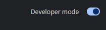

# CLOCK START UP PAGE CHROME EXTENSION

A website created as a replacement for chrome's startup or new tab page. This works as a Chrome extension.

### Technology used:
- HTML
- CSS
- JavaScript
- OpenWeatherMap API to fetch weather data

## HOW TO SET UP?

Go to **index.html** and type your name on **line 20**. You can also modify the hyperlinks for your own personalized use.

    

Insert your **API key** and **location** on **script.js** **lines 31** and **32**. To obtain your API key, make an account in [openweathermap.org](https://openweathermap.org/) and your API key will be generated and be located in *your account name* / My API Keys. 

    

### THEN OPEN GOOGLE CHROME

Go to **chrome://extensions/** and enable **developer mode** on the upper right corner.

    

Click **load unpacked** from the upper left corner and select this folder.

    

## DONE! Try opening a new tab.
